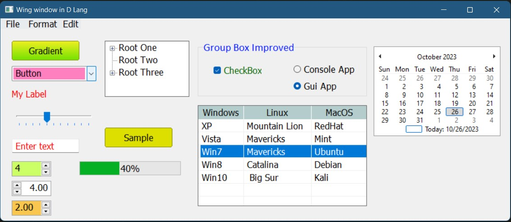

# Wings - A simple GUI library for D based on Win32 API.

# Screenshots





## How to use:
1. Clone or download the repo.
2. Place the **wings** folder in your project folder.
3. Import **wings** module in your source file. Done.
4. NOTE: You need a manifest file to style your gui. Copy and paste the `app.exe.manifest` file from this repo to your exe location. And rename the file with your exe file's name. For example, if your exe file's name is `program.exe`, the manifest file must be `program.exe.manifest`.

## Sample code
This is the code that created the window in above screenshot
```d

import std.stdio;
import wings;
//import core.sys.windows.windows;
import std.stdio : log = writeln;
import std.format;
import std.conv;
import std.string;
import wings.imagelist;

//dmd -i -run app.d

Window frm;
Button btn, btnor, b3;
CheckBox cb;
ComboBox cmb;
DateTimePicker dtp;
Calendar cal;
Label lbl;
//ListBox lbx;
ListView lv;
NumberPicker np;
RadioButton rb, rb2;
TextBox tb;
TrackBar tk;
TreeView tv;
GroupBox gb;
ProgressBar pb;
MenuBar mb;


void main()
{
	frm = new Window("Wing window in D Lang", 920, 400);
	frm.enablePrintPoint; // A handy feature. It will print the mouse points.
	frm.createHandle();

	mb = new MenuBar(frm);
	mb.addMenus("File", "Edit", "Format");
	mb.menus["File"].addMenus("New Work", "Exit");
	auto mnuEdit = mb.menus["Edit"];
	mnuEdit.addMenu("Copy");
	mnuEdit.addSeperator();
	mnuEdit.addMenu("Paste");
	auto mnuExit = mb.menus["File"].menus["Exit"];
	mnuExit.onClick = (c, e) => print(c.text);
	mb.create();

	cmb = new ComboBox(frm, 20, 65, 150, 30);
	cmb.addRange("Window", "Button", "Calendar", "CheckBox", "DateTimePicker", "GroupBox");

	//cmb.dropDownStyle = DropDownStyle.labelCombo;
	cmb.backColor = 0xff80bf;

	tb = new TextBox(frm, 20, 195);
	tb.foreColor = 0xff0000;

	btn = new Button(frm, "Gradient" );
	btn.width = 120;
	btn.setGradientColors(0xeeef20, 0x70e000);
	btn.onMouseClick = &btnClick;

	b3 = new Button(frm, "Sample", 185, 175 );
	b3.backColor = 0xdddf00;
	b3.onMouseClick = &onb3Click;

	lbl = new Label(frm, "My Label", 20, 105);
	lbl.foreColor = 0xff0000;

    tk = new TrackBar(frm, 20, 145, 150, 40, true, true, &onTrackValueChanged);

    tv = new TreeView(frm, 185, 20, 150, 100, true);
	tv.backColor = 0xddddbb;

	auto n1 = new TreeNode("Root One");
	auto n2 = new TreeNode("Root Two");
	auto n3 = new TreeNode("Root Three");
	tv.addNodes(n1, n2, n3);
	auto cn1 = new TreeNode("Child1 of Root One");
	auto cn2 = new TreeNode("Child2 of Root One");
	auto cn3 = new TreeNode("Child1 of Root Three");
	auto cn4 = new TreeNode("Child2 of Root Three");
	tv.addChildNodes(n1, cn1, cn2);
	tv.addChildNodes(n3, cn3, cn4);

	auto cn5 = new TreeNode("Child3 of Root One");
	tv.insertChildNode(n1, cn5, 1);

    gb = new GroupBox(frm, "Group Box Improved", 350, 20, 300, 100);
	gb.font = new Font("Calibri", 14);
	gb.foreColor = 0x0015ff;

	pb = new ProgressBar(frm, 140, 235, true);
	pb.showPercentage = true;

	cb = new CheckBox(frm, "CheckBox 1", 362, 62);
	cb.foreColor = 0x006400;

	auto rb1 = new RadioButton(frm, "Console App", 520, 60, true);
	auto rb2 = new RadioButton(frm, "Gui App", 520, 90, true);
	auto cal = new Calendar(frm, 662, 30, true);

	np = new NumberPicker(frm, 20, 235, true);
	np.decimalPrecision = 0;
    np.backColor = 0xccff66;

	auto np2 = new NumberPicker(frm, 20, 270);
	np2.buttonOnLeft = true;

	auto np3 = new NumberPicker(frm, 20, 305);
    np3.backColor = 0xf9c74f;

	lv = new ListView(frm, 350, 135, 300, 180, true,
						 ["Windows", "Linux", "MacOS"], [80, 120, 100] );

	lv.addRow("XP", "Mountain Lion", "RedHat");
    lv.addRow("Vista", "Mavericks", "Mint");
    lv.addRow("Win7", "Mavericks", "Ubuntu");
    lv.addRow("Win8", "Catalina", "Debian");
    lv.addRow("Win10", " Big Sur", "Kali");

	auto cm = new ContextMenu(); // A simple context menu for list view
	cm.addMenus("Add Work", "Give Work", "Finish Work");
	lv.contextMenu = cm;

	frm.show();
}

// Progress bar will move when we change the track bar value
void onTrackValueChanged(Control s, EventArgs e)
{
	pb.value = cast(int)tk.value;
}

```


