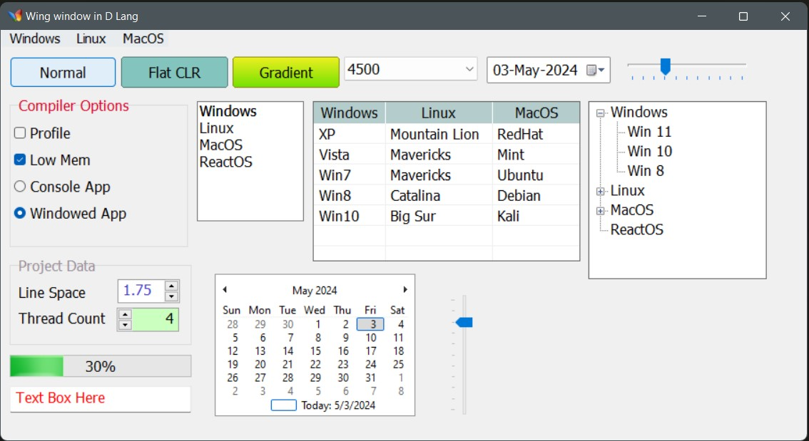

# Wings - A simple GUI library for D based on Win32 API.

# Screenshots





## How to use:
1. Clone or download the repo.
2. Place the **wings** folder in your project folder.
3. Import **wings** module in your source file. Done.
4. NOTE: You need a manifest file to style your gui. Copy and paste the `app.exe.manifest` file from this repo to your exe location. And rename the file with your exe file's name. For example, if your exe file's name is `program.exe`, the manifest file must be `program.exe.manifest`.

## Sample code
This is the code that created the window in above screenshot
```C#

import std.stdio;
import wings;
import std.stdio : log = writeln;
import std.format;
import std.conv;
import std.string;
import std.functional;
import wings.imagelist;

Window frm;
Button btn1, btn2, btn3, btnor, b3;
CheckBox cb1, cb2;
ComboBox cmb;
DateTimePicker dtp;
Calendar cal;
Label lb1, lb2, lb3;
ListBox lbx;
ListView lv;
NumberPicker np1, np2;
RadioButton rb1, rb2;
TextBox tb;
TrackBar tkb, tk2;
TreeView tv;
GroupBox gb1, gb2;
ProgressBar pgb;
MenuBar mb;

void main() 
{
	frm = new Window("Wing window in D Lang", 920, 500);
	frm.enablePrintPoint;
	frm.createHandle();

	// Let's add a menu bar and some menu items
	mb = frm.addMenuBar("Windows", "Linux", "MacOS");
	mb.menus["Windows"].addItems("Windows 8", "Windows 10", "Windows 11");
	mb.menus["Linux"].addItems("Ubuntu", "Debian", "Kali");
	mb.menus["MacOS"].addItems("Mavericks", "Catalina", "Big Sur");

	btn1 = new Button(frm, "Normal", 10, 10);
	btn2 = new Button(frm, "Flat CLR", btn1.right!5, 10);
	btn3 = new Button(frm, "Gradient", btn2.right!5, 10 );

	btn2.backColor = 0x83c5be;
	btn3.setGradientColors(0xeeef20, 0x70e000);

	cmb = new ComboBox(frm, btn3.right!5, 10, 150, 30);
	cmb.addRange("Window", "Button", "Calendar", "CheckBox", "DateTimePicker", "GroupBox", 4500);
	cmb.dropDownStyle = DropDownStyle.labelCombo;
	
	dtp = new DateTimePicker(frm, cmb.right!10, 10);

	gb1 = new GroupBox(frm, "Compiler Options", 10, btn1.bottom!10, 200, 170);
	gb1.foreColor = 0xd90429;

	cb1 = new CheckBox(frm, "Profile", 15, btn1.bottom!40);
	cb2 = new CheckBox(frm, "Low Mem", 15, cb1.bottom!10);

	rb1 = new RadioButton(frm, "Console App", 15, cb2.bottom!10);
	rb2 = new RadioButton(frm, "Windowed App", 15, rb1.bottom!30);

	gb2 = new GroupBox(frm, "Project Data", 10, gb1.bottom!10, 220, 100);
	gb2.foreColor = 0x9a8c98;

	lb1 = new Label(frm, "Line Space", gb2.left!10, gb2.top!30);
	lb1.createHandle();
	lb2 = new Label(frm, "Thread Count", gb2.left!10, lb1.bottom!10);
	lb2.createHandle();
	np1 = new NumberPicker(frm, lb1.right!33, gb2.top!25);
	np1.foreColor = 0x3f37c9;
	np1.step = 0.25;
	np2 = new NumberPicker(frm, lb2.right!10, gb2.top!57);
	np2.decimalPrecision = 0;
	np2.backColor = 0xcaffbf;
	np2.buttonOnLeft = true;

	pgb = new ProgressBar(frm, 10, gb2.bottom!10, 204, 25, true);
	pgb.showPercentage = true;

	tb = new TextBox(frm, 10, pgb.bottom!10, pgb.width, 30);
	tb.foreColor = 0xff0000;    

	lbx = new ListBox(frm, gb1.right!10, btn1.bottom!15, 120, 160);
	lbx.addRange("Windows", "Linux", "MacOS", "ReactOS");	

	lv = new ListView(frm, lbx.right!10, btn1.bottom!15, 300, 180, true,
						 ["Windows", "Linux", "MacOS"], [80, 120, 100] );

	lv.addRow("XP", "Mountain Lion", "RedHat");
    lv.addRow("Vista", "Mavericks", "Mint");
    lv.addRow("Win7", "Mavericks", "Ubuntu");
    lv.addRow("Win8", "Catalina", "Debian");
    lv.addRow("Win10", "Big Sur", "Kali");

	lv.addContextMenu("Windows", "Linux", "MacOS");

	tkb = new TrackBar(frm, dtp.right!10, 10, 150, 40, true, true, toDelegate(&onTrackValueChanged));
    

	tv = new TreeView(frm, lv.right!10, lv.ypos, 200, 200, true);
	tv.backColor = 0xddddbb;
	auto n1 = new TreeNode("Windows");
	auto n2 = new TreeNode("Linux");
	auto n3 = new TreeNode("MacOS");
	auto n4 = new TreeNode("ReactOS");
	tv.addNodes(n1, n2, n3, n4);
	auto wn1 = new TreeNode("Win 11");
	auto wn2 = new TreeNode("Win 10");
	auto wn3 = new TreeNode("Win 8");	
	tv.addChildNodes(n1, wn1, wn2, wn3);
	auto ln1 = new TreeNode("Ubuntu");
	auto ln2 = new TreeNode("Debian");
	auto ln3 = new TreeNode("Fedora");
	tv.addChildNodes(n2, ln1, ln2, ln3);
	auto mn1 = new TreeNode("Monterey");
	auto mn2 = new TreeNode("Catalina");
	auto mn3 = new TreeNode("Mojave");
	tv.addChildNodes(n3, mn1, mn2, mn3);

	cal = new Calendar(frm, gb2.right!10, lv.bottom!15);

	tk2 = new TrackBar(frm, 500, 270, 60, 150);
	tk2.vertical = true;

	// Lets add a timer which ticks at 800 ms interval.
	void timer_handler(Control c, EventArgs e) {writeln("Timer ticked...");}
	auto timer = frm.addTimer(800, &timer_handler);

	// This function will start the timer when we click the button.
	void b3_handler(Control c, EventArgs e) {timer.start();}   

	// All set, now we are going to display our form.
	frm.show();
}


// This function will be called when we drag the slider of the TrackBar
void onTrackValueChanged(Control s, EventArgs e) 	
{ 
	// We will update the progress bar on each drag.
	pgb.value = cast(int)tkb.value;
}

```


